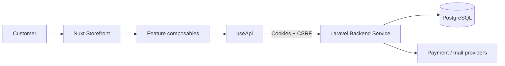
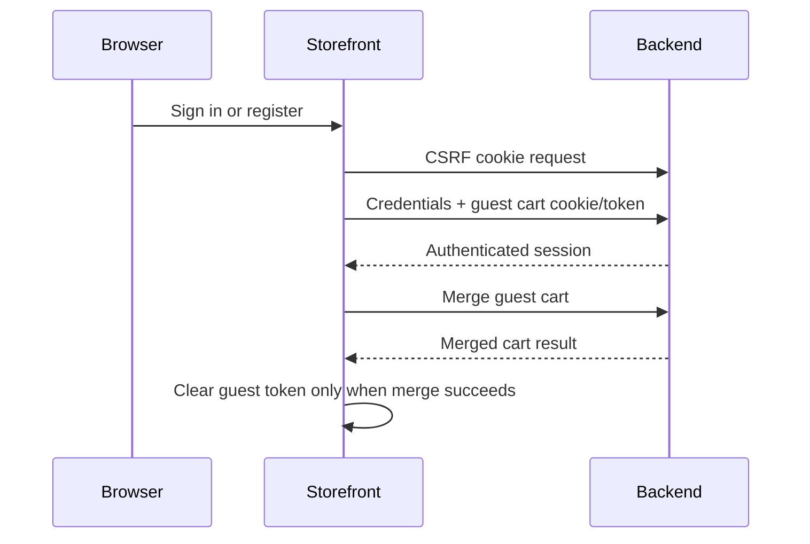

# Storefront architecture

## Purpose

The Storefront is the browser-facing presentation layer for a Glamrush storefront. It owns customer interaction state and rendering, while the Backend Service remains authoritative for identity, catalog visibility, inventory, pricing, discounts, orders, and payments.

## Rendering and routing

Nuxt file-based routes cover the homepage, category and product pages, authentication, account, checkout, payment callbacks, FAQs, contact, and dynamic content pages. SSR remains enabled by default, which supports server-rendered public pages and initial customer-session hydration.

Dynamic routes:

- `/category/:slug`
- `/product/:slug`
- `/payment/callback`
- `/:slug` for published static content

The generic content route must remain less specific than dedicated application routes.

## API boundary

`app/composables/useApi.ts` is the only low-level HTTP boundary. It:

- Builds requests from public runtime configuration
- Sends `Accept` and JSON content headers
- Includes credentials
- Forwards browser cookies during SSR
- Obtains and sends the Sanctum CSRF token for mutations
- Retries one mutation after a `419` CSRF response
- Preserves API error responses for feature-level handling

Higher-level composables expose customer workflows rather than raw paths:

| Composable | Responsibility |
| --- | --- |
| `useStorefront` | Homepage, configuration, categories, product listing/detail |
| `useCart` | Guest/authenticated bag state and quantity mutations |
| `useCheckout` | Shipping, discounts, order creation, payment, cart restore |
| `useAuth` | Session, registration, login, social login, recovery, cart merge |
| `useCustomerAccount` | Addresses, saved items, and order history |
| `useLocations` | Country, state, and city options |
| `useContent` | Static pages, FAQs, and contact submissions |

## State model

Nuxt `useState` provides request-safe shared application state for authentication and cart data. The guest cart token is stored in the `glamrush_cart_token` cookie. No client-side store duplicates the server's order or payment state.

Cart quantity changes use optimistic local state and a short debounce window. Multiple rapid clicks update the visible quantity immediately, then send one consolidated request. Failures refetch authoritative cart state.

## Authentication and cart merge

The Laravel session is held in an HttpOnly cookie. JavaScript can read only the CSRF token and the non-sensitive guest cart token. Protected pages use auth middleware, but the Backend Service is always responsible for authorization.

## Catalog presentation

The Storefront renders products from Backend resource contracts. Product cards and details handle:

- Simple and variable products
- Effective regular/sale prices
- Variant availability and stock limits
- Primary and additional product imagery
- Variant-specific image replacement
- Fallback imagery when media is absent
- HTML descriptions rendered only from trusted/sanitized Backend content

Search and filter state maps to Backend query parameters; facets and pagination remain server-calculated.

## Checkout and payment

The browser gathers addresses, selects an API-returned shipping option, previews discounts, and submits checkout with a generated idempotency key. The Backend recalculates totals and reserves inventory.

Payment callback pages treat provider query parameters as hints only and ask the Backend to verify the transaction. Completed views display authoritative receipt/order data; failures allow recovery or cart restoration where supported.

## UI and accessibility

Nuxt UI supplies primitives, Tailwind provides layout and visual styling, and Lucide icons are bundled through Iconify. Components should preserve semantic buttons/forms, keyboard operation, focus visibility, accessible modal behavior, descriptive images, and non-color-only state indicators.

## Deployment

For a Nuxt server deployment, run the generated Nitro server behind HTTPS. For Cloudflare, select and test the appropriate Nitro preset rather than uploading `.output` without a runtime plan.

Production checks:

- Public API/backend origins are correct
- Sanctum stateful domains and CORS match exactly
- `SESSION_DOMAIN` supports the intended subdomains
- Secure cookies are enabled
- `/payment/callback` and dynamic content routes resolve directly
- Google OAuth contains the deployed JavaScript origin
- CDN rules do not cache authenticated HTML or API responses incorrectly
- Static assets use long immutable caching

## Testing direction

There is no automated test script today. Recommended coverage:

- Vitest for composables, formatting, and cart debounce behavior
- Nuxt Test Utils for product, auth, account, and checkout components
- Playwright for guest checkout, login/cart merge, payment callback, filters, and account workflows
- Contract tests generated from the checked-in Backend API schema
